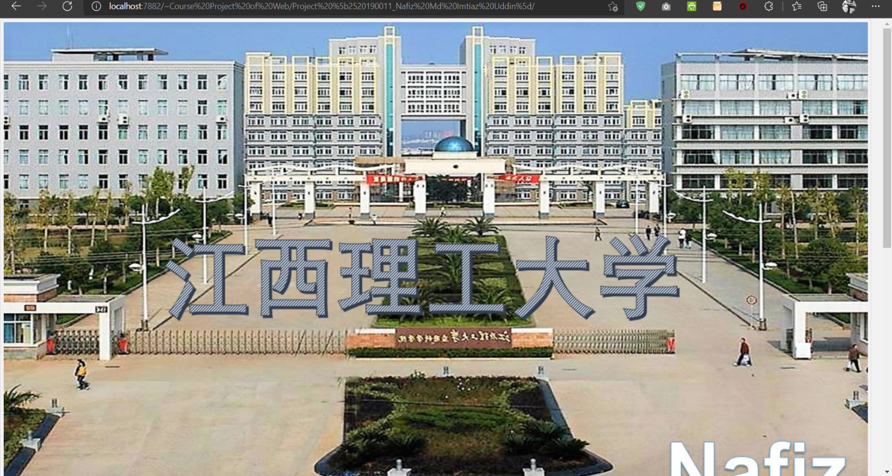
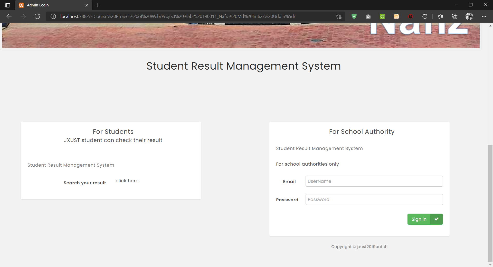
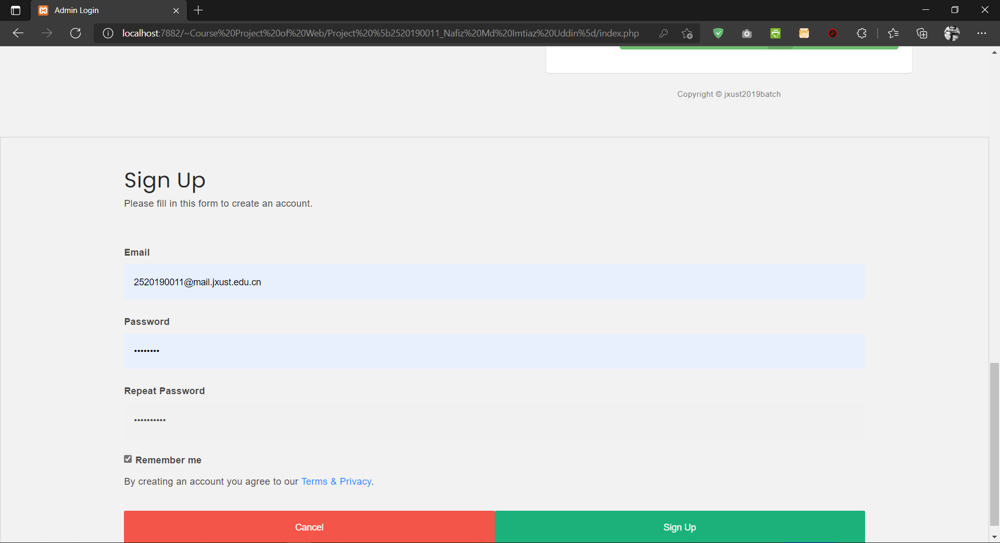
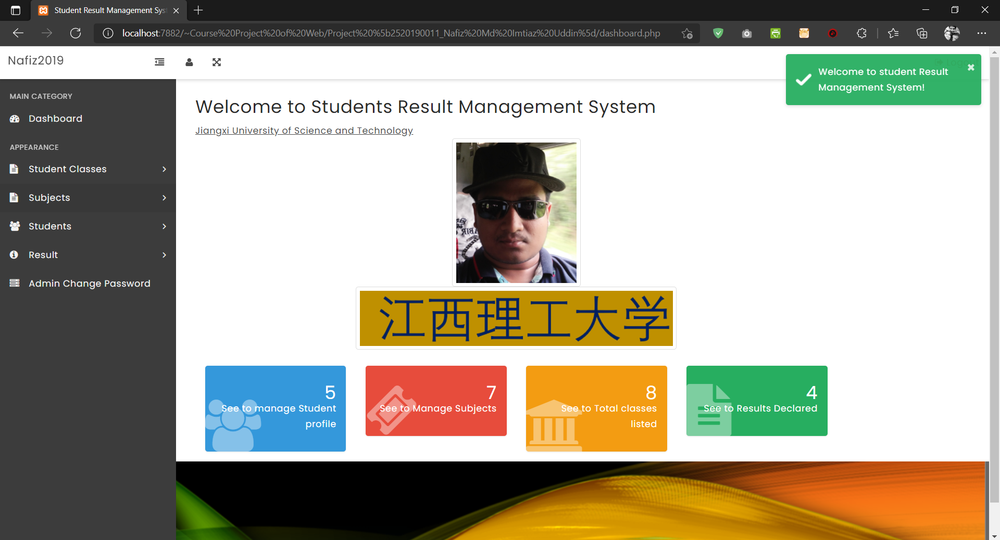

# <b>Student Result Management System with PHP</b>

## [Click for see this project...]([https://www.slideshare.net/secret/BTdAUqpl1K16k4](https://www.slideshare.net/NafizMdImtiazUddin/php-student-result-management-system))
<b>Software:</b>
- VS code
- PHP language [Web application]
- Others: HTML, CSS, bootstrap, js, jquery
- XAMPP (MySQL)

 

### Here is inclued some screenshots:

...............................
...............................

## [See more screenshots...](https://www.slideshare.net/NafizMdImtiazUddin/php-student-result-management-system)

